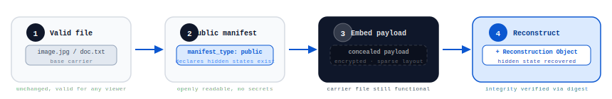
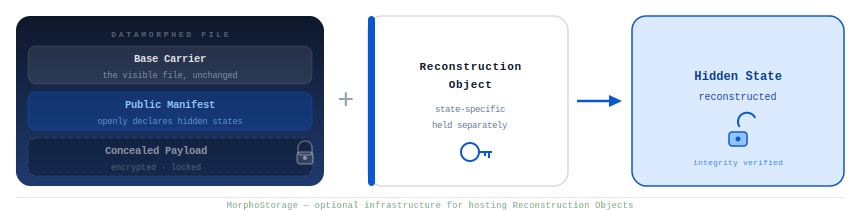
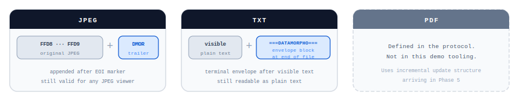

# DATAMORPHO

**Website:** https://datamorpho.io  
**Repository:** https://github.com/ariutokintumi/datamorpho  
**Specification version:** `0.001` — Public Draft

---

**Datamorpho** is an open file standard for **multi-state files**.

A Datamorphed file remains valid in its original format while containing one or more **sealed hidden states** that can be reconstructed later using a state-specific reconstruction object.

Datamorpho is **not steganography**.  
A Datamorphed file is expected to **publicly declare** that hidden states exist and where reconstruction information may later be found.

## Core idea

Datamorpho separates a file into four conceptual layers:

1. **Base carrier** — the ordinary visible file
2. **Public manifest** — declares Datamorphosis, states, triggers, and MorphoStorage
3. **Concealed payload** — hidden bytes embedded in the carrier
4. **Reconstruction object** — the secret-bearing object used to reconstruct one hidden state

A hidden state may be built from:

- multiple fragments
- non-monotonic offsets
- sparse layout
- sparse-with-chaff layout
- heterogeneous cryptographic suites across fragments of the same state

## Why Datamorpho matters

Datamorpho enables:

- controlled disclosure of hidden file states
- staged media and document releases
- archives and delayed publication workflows
- games, unlockable items, and interactive assets
- financial and auction disclosure flows
- censorship-resistant wide distribution with later reveal
- digital objects that evolve without changing the original carrier file

A strong example is NFT pre-reveal / reveal without moving metadata, but Datamorpho is designed as a broader file standard, not as an NFT-only system.

## Current version

**Specification version:** `0.001`  
**Status:** Public Draft  
**Web tools:** https://datamorpho.io/tools

### Protocol-level carrier profiles in the current public materials

- JPEG
- TXT
- PDF

### First usable reference implementation

The first usable reference implementation currently supports:

- JPEG
- TXT

PDF is part of the broader protocol discussion and public materials, but it is intentionally not enabled in the first usable implementation.

### Immediate next media targets after the first implementation wave

- Audio
- Video

## Documents

| Document | In this repo | On the website |
|---|---|---|
| Specification | [Datamorpho-Specification-v0.001.md](./docs/specification/Datamorpho-Specification-v0.001.md) | [datamorpho.io/specification](https://datamorpho.io/specification) |
| Whitepaper | [Datamorpho-Whitepaper-v0.001.md](./docs/whitepaper/Datamorpho-Whitepaper-v0.001.md) | [datamorpho.io/whitepaper](https://datamorpho.io/whitepaper) |
| FAQ | [faq.md](./docs/faq/faq.md) | [datamorpho.io/faq](https://datamorpho.io/faq) |
| Glossary | [glossary.md](./docs/glossary/glossary.md) | [datamorpho.io/glossary](https://datamorpho.io/glossary) |
| Changelog | [CHANGELOG.md](./CHANGELOG.md) | [datamorpho.io/changelog](https://datamorpho.io/changelog) |
| Roadmap | — | [datamorpho.io/roadmap](https://datamorpho.io/roadmap) |
| Examples | [JPEG real fixture](./python/datamorpho/tests/jpg_real_test/) | [datamorpho.io/examples](https://datamorpho.io/examples) |

## Reference tooling

Current reference tooling in this repository:

- Python creator tooling
- Python reconstruction tooling
- website pages prepared for future browser-side JavaScript integration
- tests for the first Python implementation

Planned next:

- browser-side JavaScript library derived from the tested Python reference implementation
- more examples and interoperability vectors
- broader carrier support after the first implementation wave is stable

## Repository structure

- `docs/` — specification, whitepaper, FAQ, glossary, diagrams, and related public materials
- `python/` — Python reference implementation for creating and reconstructing Datamorphed files
  - `python/datamorpho/tests/jpg_real_test/` — real JPEG fixture set (carrier, hidden states, outputs, reconstruction objects)
- `site/` — website source code and public pages
- `CHANGELOG.md` — public release history
- `SECURITY.md` — security and reporting guidance
- `CONTRIBUTING.md` — contribution guidance
- `Makefile` — convenience commands for install, test, create, reconstruct, and clean

## Project status

Datamorpho is currently in the **open specification + first tooling** phase.

The current focus is:

1. keep the specification coherent
2. keep the whitepaper aligned
3. stabilize the first Python tooling
4. prepare the browser-side JavaScript implementation
5. expand examples and test vectors

## Discussion

- [GitHub Discussions](https://github.com/ariutokintumi/datamorpho/discussions) — protocol and design discussion
- [GitHub Issues](https://github.com/ariutokintumi/datamorpho/issues) — concrete specification and implementation issues
- [datamorpho.io/community](https://datamorpho.io/community) — community page

## Author

**Germán Abal** — [@ariutokintumi](https://x.com/ariutokintumi) — g@evvm.org

## Contributors

- Ben Dumoulin — [@BenDumoulin](https://x.com/BenDumoulin) — early PoC implementation support
- R. Benson Evans — [@iglobecreator](https://x.com/iglobecreator) — early PoC research support
- Eduardo — [@metaversearchi_](https://x.com/metaversearchi_) — early PoC design support

## License

Reference software is intended to be released under the **MIT License**.